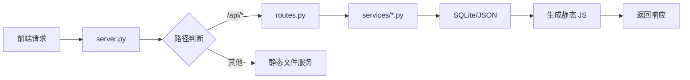

# MAERS 后端开发指南 (Backend Development Guide)

本文档提供后端 API 开发、数据库操作和服务扩展的完整指南。

---

## 目录

1. [后端架构概览](#1-后端架构概览)
2. [添加新 API](#2-添加新-api)
3. [数据库操作](#3-数据库操作)
4. [业务逻辑开发](#4-业务逻辑开发)
5. [高级功能](#5-高级功能)

---

## 1. 后端架构概览

### 1.1 核心组件

```
_studio/
├── server.py           # HTTP 服务入口
├── routes.py           # 路由分发中心
├── config.py           # 配置常量
└── services/           # 业务逻辑层
    ├── cms.py          # 笔记/文学/记录
    ├── album.py        # 相册管理
    ├── music.py        # 音乐管理
    ├── bili.py         # B站视频信息
    └── category.py     # 相册分类
```

### 1.2 请求处理流程



### 1.3 技术栈

- **HTTP 服务**: Python 标准库 `http.server`
- **数据库**: SQLite3（文件数据库）
- **配置存储**: JSON 文件
- **图片处理**: Pillow (可选)

---

## 2. 添加新 API

### 2.1 简单 GET 接口

**场景**: 获取系统状态

**步骤1: 注册路由** (`_studio/routes.py`)

```python
def dispatch_get(path, query_params):
    # 现有代码...
    
    # [新增] 系统状态接口
    if parsed_path == '/api/system/status':
        import time
        return 200, {
            "status": "online",
            "time": time.strftime("%Y-%m-%d %H:%M:%S"),
            "version": "2.7"
        }
    
    return 404, None
```

**步骤2: 测试**
```bash
# 重启服务
python _studio/server.py

# 访问
http://localhost:8000/api/system/status
```

### 2.2 POST 接口（带数据处理）

**场景**: 添加新笔记

**步骤1: 在现有服务中添加** (`_studio/services/cms.py`)

```python
def create_note(module, title, content):
    """创建新笔记"""
    conn = get_connection()
    cursor = conn.cursor()
    
    # 插入数据
    cursor.execute('''
        INSERT INTO nodes (module, title, content, type, created_at)
        VALUES (?, ?, ?, 'file', datetime('now'))
    ''', (module, title, content))
    
    conn.commit()
    note_id = cursor.lastrowid
    conn.close()
    
    # 重要：同步静态 JS 文件
    sync_js_file(module)
    
    return note_id
```

**步骤2: 注册路由** (`_studio/routes.py`)

```python
def dispatch_post(path, query_params, body):
    # 现有代码...
    
    if parsed_path == '/api/notes/create':
        from services.cms import create_note
        
        title = body.get('title')
        content = body.get('content')
        
        note_id = create_note('notes', title, content)
        return 200, {"id": note_id, "message": "创建成功"}
```

---

## 3. 数据库操作

### 3.1 数据库结构

**CMS 数据库** (`data/cms.db`)

```sql
CREATE TABLE nodes (
    id INTEGER PRIMARY KEY AUTOINCREMENT,
    module TEXT NOT NULL,           -- 'notes', 'literature', 'record'
    parent_id INTEGER,
    type TEXT NOT NULL,             -- 'folder', 'file'
    title TEXT NOT NULL,
    content TEXT,
    tags TEXT,
    order_index INTEGER DEFAULT 0,
    created_at TIMESTAMP,
    updated_at TIMESTAMP
);
```

**相册数据库** (`data/gallery.db`)

```sql
CREATE TABLE photos (
    id INTEGER PRIMARY KEY AUTOINCREMENT,
    category TEXT NOT NULL,
    filename TEXT NOT NULL,
    md5 TEXT UNIQUE NOT NULL,
    order_index INTEGER DEFAULT 0,
    created_at TIMESTAMP
);
```

### 3.2 数据库连接

```python
import sqlite3

def get_connection():
    """获取数据库连接"""
    conn = sqlite3.connect('data/cms.db')
    conn.row_factory = sqlite3.Row  # 返回字典格式
    return conn
```

### 3.3 CRUD 操作示例

**查询**:
```python
def get_note(note_id):
    conn = get_connection()
    cursor = conn.cursor()
    cursor.execute('SELECT * FROM nodes WHERE id = ?', (note_id,))
    row = cursor.fetchone()
    conn.close()
    return dict(row) if row else None
```

**插入**:
```python
def insert_note(data):
    conn = get_connection()
    cursor = conn.cursor()
    cursor.execute('''
        INSERT INTO nodes (title, content, type)
        VALUES (?, ?, ?)
    ''', (data['title'], data['content'], 'file'))
    conn.commit()
    note_id = cursor.lastrowid
    conn.close()
    return note_id
```

**更新**:
```python
def update_note(note_id, data):
    conn = get_connection()
    cursor = conn.cursor()
    cursor.execute('''
        UPDATE nodes 
        SET title = ?, content = ?, updated_at = datetime('now')
        WHERE id = ?
    ''', (data['title'], data['content'], note_id))
    conn.commit()
    conn.close()
```

**删除**:
```python
def delete_note(note_id):
    conn = get_connection()
    cursor = conn.cursor()
    cursor.execute('DELETE FROM nodes WHERE id = ?', (note_id,))
    conn.commit()
    conn.close()
```

### 3.4 静态文件同步

**重要**: 每次修改数据库后，必须重新生成静态 JS 文件

```python
def sync_js_file(module):
    """将数据库数据同步到静态 JS 文件"""
    conn = get_connection()
    cursor = conn.cursor()
    
    # 查询数据
    cursor.execute('''
        SELECT * FROM nodes 
        WHERE module = ? 
        ORDER BY order_index
    ''', (module,))
    
    rows = cursor.fetchall()
    conn.close()
    
    # 构建树结构
    data = build_tree(rows)
    
    # 写入 JS 文件
    js_path = f'data/{module}-tree.js'
    with open(js_path, 'w', encoding='utf-8') as f:
        f.write(f'window.MAERS_DATA = {json.dumps(data, ensure_ascii=False)};')
```

---

## 4. 业务逻辑开发

### 4.1 添加新服务模块

**场景**: 添加待办事项功能

**步骤1: 创建数据表**

```sql
-- 在 cms.db 中执行
CREATE TABLE todos (
    id INTEGER PRIMARY KEY AUTOINCREMENT,
    title TEXT NOT NULL,
    completed INTEGER DEFAULT 0,
    created_at TIMESTAMP DEFAULT CURRENT_TIMESTAMP
);
```

**步骤2: 创建服务文件** (`_studio/services/todo.py`)

```python
import sqlite3
import json

def get_connection():
    conn = sqlite3.connect('data/cms.db')
    conn.row_factory = sqlite3.Row
    return conn

def get_all_todos():
    """获取所有待办"""
    conn = get_connection()
    cursor = conn.cursor()
    cursor.execute('SELECT * FROM todos ORDER BY created_at DESC')
    rows = cursor.fetchall()
    conn.close()
    return [dict(row) for row in rows]

def create_todo(title):
    """创建待办"""
    conn = get_connection()
    cursor = conn.cursor()
    cursor.execute('INSERT INTO todos (title) VALUES (?)', (title,))
    conn.commit()
    todo_id = cursor.lastrowid
    conn.close()
    
    # 同步到静态文件
    sync_todos_js()
    return todo_id

def sync_todos_js():
    """同步到静态 JS"""
    todos = get_all_todos()
    with open('data/todos.js', 'w', encoding='utf-8') as f:
        f.write(f'window.TODOS_DATA = {json.dumps(todos, ensure_ascii=False)};')
```

**步骤3: 注册路由** (`_studio/routes.py`)

```python
def dispatch_get(path, query_params):
    # ...
    if parsed_path == '/api/todos':
        from services.todo import get_all_todos
        return 200, get_all_todos()

def dispatch_post(path, query_params, body):
    # ...
    if parsed_path == '/api/todos/create':
        from services.todo import create_todo
        todo_id = create_todo(body.get('title'))
        return 200, {"id": todo_id}
```

---

## 5. 高级功能

### 5.1 图片上传处理

**位置**: `_studio/services/album.py`

**核心流程**:
```python
from PIL import Image
import hashlib
import io

def handle_upload(file_data, category):
    """处理图片上传"""
    # 1. MD5 查重
    md5 = hashlib.md5(file_data).hexdigest()
    if check_duplicate(md5):
        return {"error": "图片已存在"}
    
    # 2. 打开图片
    img = Image.open(io.BytesIO(file_data))
    img = ImageOps.exif_transpose(img)  # 修正方向
    
    # 3. 生成 AVIF 预览图 (2560px)
    preview_path = f'photos/previews/{md5}.avif'
    save_compressed(img, preview_path, 'AVIF', 2560)
    
    # 4. 生成 WebP 缩略图 (600px)
    thumb_path = f'photos/thumbnails/{md5}.webp'
    save_compressed(img, thumb_path, 'WEBP', 600)
    
    # 5. 保存原图
    original_path = f'photos/images/{md5}.jpg'
    img.save(original_path, 'JPEG', quality=95)
    
    # 6. 写入数据库
    save_to_database(md5, category)
    
    # 7. 同步静态 JS
    sync_gallery_js()
    
    return {"success": True, "md5": md5}
```

### 5.2 B站视频信息获取

**位置**: `_studio/services/bili.py`

**功能**: 作为代理获取 B站视频元数据（封面、标题、时长）

```python
import urllib.request
import json

def get_bili_info(bvid):
    """获取 B站视频信息"""
    url = f'https://api.bilibili.com/x/web-interface/view?bvid={bvid}'
    
    # 伪装 User-Agent
    headers = {
        'User-Agent': 'Mozilla/5.0 (Windows NT 10.0; Win64; x64)'
    }
    
    req = urllib.request.Request(url, headers=headers)
    with urllib.request.urlopen(req) as response:
        data = json.loads(response.read().decode('utf-8'))
    
    if data['code'] == 0:
        video = data['data']
        return {
            "title": video['title'],
            "cover": video['pic'],
            "duration": video['duration']
        }
    else:
        return {"error": "获取失败"}
```

### 5.3 错误处理

**统一错误处理**:

```python
def dispatch_post(path, query_params, body):
    try:
        # 业务逻辑
        if parsed_path == '/api/notes/create':
            result = create_note(body)
            return 200, result
    except Exception as e:
        # 记录错误
        print(f"Error: {str(e)}")
        return 500, {"error": str(e)}
```

---

## 6. 常见问题

### Q: 修改 Python 代码后没生效？

**原因**: Python 服务未重启

**解决方案**:
```bash
# 关闭正在运行的服务（关闭黑窗口）
# 重新启动
python _studio/server.py
```

### Q: 前端看不到新数据？

**原因**: 忘记调用 `sync_js_file()`

**解决方案**: 每次数据库写操作后，必须调用同步函数

### Q: 数据库被锁定？

**原因**: SQLite 不支持高并发写入

**解决方案**:
```python
# 添加超时设置
conn = sqlite3.connect('data/cms.db', timeout=10)
```

---

## 7. 开发工作流

### 7.1 添加新功能流程

```
1. 设计数据结构（表结构）
2. 创建/修改 services/*.py（业务逻辑）
3. 在 routes.py 注册路由
4. 实现 sync_js_file（静态同步）
5. 重启服务测试
6. 前端集成
```

### 7.2 调试技巧

**打印调试**:
```python
print(f"Debug: {variable}")  # 输出到控制台
```

**SQL 调试**:
```python
cursor.execute('SELECT * FROM nodes WHERE id = ?', (note_id,))
print(cursor.lastrowid)  # 打印最后插入的 ID
```

---

## 8. 部署建议

### 8.1 安全检查清单

- [ ] 添加 API 鉴权（Token/Session）
- [ ] 验证用户输入
- [ ] 限制文件上传大小
- [ ] 配置 CORS 策略

### 8.2 性能优化

- [ ] 添加数据库索引
- [ ] 使用连接池
- [ ] 缓存频繁查询结果
- [ ] 异步处理图片压缩

---

**最后更新**: 2026-01-17  
**版本**: v2.7（目录结构重构后）
