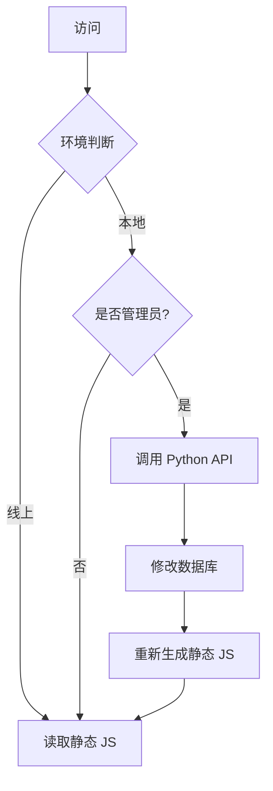
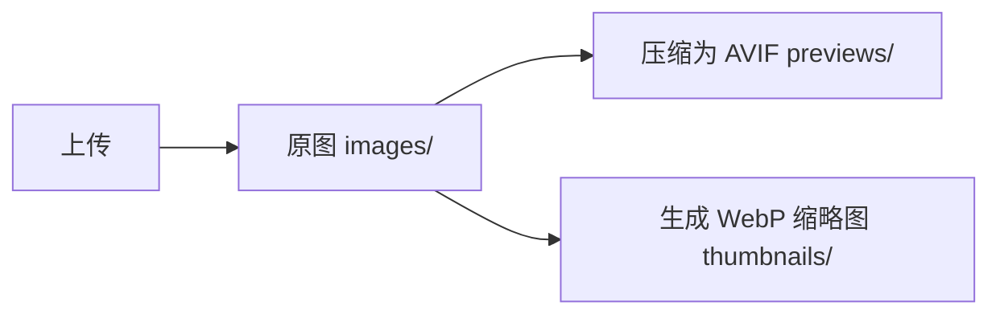

# MAERS 架构决策记录 (Architecture Decision Records)

本文档记录了 MAERS 项目中的重要架构决策及其背后的思考过程。

---

## 📋 目录

- [ADR-001: 选择无框架架构](#adr-001-选择无框架架构)
- [ADR-002: 采用 JS 封装 JSON 模式](#adr-002-采用-js-封装-json-模式)
- [ADR-003: 使用 SQLite 而非 MySQL](#adr-003-使用-sqlite-而非-mysql)
- [ADR-004: 前后端混合架构](#adr-004-前后端混合架构)
- [ADR-005: 模块化目录结构](#adr-005-模块化目录结构)
- [ADR-006: 命名空间模式](#adr-006-命名空间模式)
- [ADR-007: 图片多格式存储策略](#adr-007-图片多格式存储策略)
- [ADR-008: 管理端与访问端分离](#adr-008-管理端与访问端分离)
- [ADR-009: 废弃内联事件](#adr-009-废弃内联事件)

---

## ADR-001: 选择无框架架构

**日期**: 2024-06-15  
**状态**: ✅ 已采纳  
**决策者**: 项目创始人

### 背景

现代前端开发通常依赖 React、Vue 等框架，但这些框架带来了：

- 庞大的依赖树（node_modules 动辄几百 MB）
- 复杂的构建流程（Webpack/Vite 配置）
- 版本迁移成本（框架升级可能导致大量代码重写）

### 决策

**采用原生 HTML/CSS/JavaScript，不使用任何前端框架。**

### 理由

| 优势           | 说明                                    |
| :------------- | :-------------------------------------- |
| **极致轻量**   | 整个项目无需 `npm install`，克隆即用    |
| **长期稳定**   | 不受框架版本迭代影响，10 年后依然可运行 |
| **性能优越**   | 无虚拟 DOM 开销，直接操作原生 DOM       |
| **学习成本低** | 任何懂 HTML/CSS/JS 的人都能看懂代码     |
| **完全掌控**   | 每一行代码都透明可见，易于定制          |

### 权衡

| 劣势         | 应对措施                             |
| :----------- | :----------------------------------- |
| 缺少组件化   | 通过模块化 JS 文件和命名空间实现     |
| 缺少状态管理 | 使用简单的 `AppState` 对象管理状态   |
| 缺少路由系统 | 使用 URL 参数 (`?module=notes`) 实现 |

### 影响

- 项目体积极小（< 5MB，不含图片）
- 加载速度极快（首屏 < 100ms）
- 维护成本低（无需关注框架更新）

---

## ADR-002: 采用 JS 封装 JSON 模式

**日期**: 2024-07-20  
**状态**: ✅ 已采纳

### 背景

前端需要读取数据，传统方案有两种：

1. **AJAX 请求 JSON** - 需要后端 API，本地打开会跨域
2. **直接嵌入 HTML** - 数据和视图耦合，难以维护

### 决策

**将 JSON 数据包装成 JS 文件，通过 `<script>` 标签加载。**

### 实现

```javascript
// data/notes-tree.js
window.MAERS_DATA = {
  root: [{ id: "1", title: "笔记1", children: [] }],
};
```

```html
<!-- notes.html -->
<script src="data/notes-tree.js"></script>
<script>
  console.log(window.MAERS_DATA); // 数据已加载
</script>
```

### 理由

| 优势           | 说明                            |
| :------------- | :------------------------------ |
| **无跨域问题** | `<script>` 标签不受同源策略限制 |
| **本地可运行** | 双击 HTML 即可打开，无需服务器  |
| **缓存友好**   | 浏览器会自动缓存 JS 文件        |
| **数据分离**   | 数据和视图解耦，易于维护        |

### 影响

- 前端可以完全静态化部署（CDN）
- 后端只需在数据变更时重新生成 JS 文件
- 支持 `file://` 协议本地打开

---

## ADR-003: 使用 SQLite 而非 MySQL

**日期**: 2024-06-20  
**状态**: ✅ 已采纳

### 背景

CMS 模块需要存储文章数据，可选方案：

1. **MySQL/PostgreSQL** - 功能强大，但需要独立服务
2. **MongoDB** - NoSQL，但依赖复杂
3. **SQLite** - 嵌入式数据库，单文件存储

### 决策

**使用 SQLite 作为主要数据库。**

### 理由

| 优势       | 说明                                |
| :--------- | :---------------------------------- |
| **零配置** | 无需安装数据库服务，Python 内置支持 |
| **单文件** | 整个数据库就是一个 `.db` 文件       |
| **易备份** | 复制文件即备份，无需 `mysqldump`    |
| **轻量级** | 适合个人项目，性能足够              |
| **跨平台** | Windows/Mac/Linux 通用              |

### 权衡

| 劣势       | 应对措施             |
| :--------- | :------------------- |
| 并发写入弱 | 个人项目无高并发需求 |
| 无网络访问 | 通过 Python API 封装 |
| 功能有限   | 对于个人博客已足够   |

### 影响

- 数据迁移极其简单（复制 `.db` 文件）
- 无需配置数据库连接字符串
- 适合 Git 版本控制（小文件）

---

## ADR-004: 前后端混合架构

**日期**: 2024-08-01  
**状态**: ✅ 已采纳

### 背景

部署方式有两种极端：

1. **纯静态** - 无后端，但无法动态修改内容
2. **纯动态** - 所有请求都查数据库，性能差

### 决策

**采用"静态优先 + 动态管理"的混合架构。**

### 架构图



### 理由

| 场景         | 方案            | 优势                   |
| :----------- | :-------------- | :--------------------- |
| **普通访问** | 读取静态 JS     | 极速加载，无数据库查询 |
| **管理操作** | 调用 Python API | 动态修改，实时生效     |
| **线上部署** | 纯静态 CDN      | 成本低，速度快         |

### 影响

- 普通访问速度极快（无后端延迟）
- 管理员可以实时编辑内容
- 支持静态部署到 GitHub Pages

---

## ADR-005: 模块化目录结构

**日期**: 2026-01-17  
**状态**: ✅ 已采纳

### 背景

随着项目增长，`custom/` 目录下文件混乱：

```
custom/
├── album-admin.js
├── album-view.js
├── cms-view.js
├── cms-editor.js
├── cms-drag.js
├── music-ui.js
├── music-player.js
└── ...
```

### 决策

**按模块分组到子目录。**

### 新结构

```
custom/
├── album/
│   ├── album-admin.js
│   └── album-view.js
├── cms/
│   ├── cms-view.js
│   ├── cms-editor.js
│   └── cms-drag.js
└── music/
    ├── music-ui.js
    ├── music-player.js
    └── ...
```

### 理由

| 优势         | 说明                             |
| :----------- | :------------------------------- |
| **清晰分组** | 一眼看出文件属于哪个模块         |
| **易于维护** | 修改某个模块时，只需关注对应目录 |
| **扩展友好** | 新增模块时，创建新目录即可       |
| **符合直觉** | 与 `music/` 目录的现有结构一致   |

### 影响

- 所有 HTML 文件的 `<script src>` 路径需更新
- 提升了代码的可维护性
- 为未来模块化打包做准备

---

## ADR-006: 命名空间模式

**日期**: 2024-09-10  
**状态**: ✅ 已采纳

### 背景

原生 JS 没有模块系统，全局变量容易冲突：

```javascript
// 多个文件都定义了 init()
function init() { ... }  // 会被覆盖
```

### 决策

**使用 `MAERS.*` 命名空间组织所有代码。**

### 实现

```javascript
// shared/namespace.js
window.MAERS = window.MAERS || {};
MAERS.Utils = MAERS.Utils || {};
MAERS.CMS = MAERS.CMS || {};
MAERS.Music = MAERS.Music || {};

// custom/cms/cms-view.js
MAERS.CMS.View = {
  init() { ... },
  render() { ... }
};

// 调用
MAERS.CMS.View.init();
```

### 理由

| 优势         | 说明                                  |
| :----------- | :------------------------------------ |
| **避免冲突** | 所有函数都在 `MAERS` 下，不污染全局   |
| **结构清晰** | 通过命名空间体现模块关系              |
| **易于调试** | 在控制台输入 `MAERS` 即可查看所有 API |
| **专业规范** | 符合大型项目的代码组织方式            |

### 影响

- HTML 中的 `onclick` 需使用完整路径（如 `MAERS.Admin.exportModules()`）
- 提升了代码的可读性和可维护性

---

## ADR-007: 图片多格式存储策略

**日期**: 2024-10-05  
**状态**: ✅ 已采纳

### 背景

上传的图片可能很大（5MB+），直接展示会导致：

- 加载慢
- 流量浪费
- 体验差

### 决策

**采用"原图 + 预览图 + 缩略图"三层存储。**

### 存储策略



| 类型       | 格式   | 尺寸   | 用途       |
| :--------- | :----- | :----- | :--------- |
| **原图**   | 原格式 | 原尺寸 | 下载/归档  |
| **预览图** | AVIF   | 2560px | 灯箱查看   |
| **缩略图** | WebP   | 600px  | 瀑布流展示 |

### 理由

| 优势         | 说明                      |
| :----------- | :------------------------ |
| **加载快**   | 瀑布流只加载小缩略图      |
| **质量高**   | 点击查看时加载高清预览图  |
| **节省流量** | AVIF 压缩率比 JPEG 高 50% |
| **兼容性**   | 保留原图作为降级方案      |

### 影响

- 上传时需要 Pillow 库处理
- 存储空间增加（但总体仍比原图小）
- 体验显著提升

---

## ADR-008: 管理端与访问端分离 (Admin/Viewer Split)

**日期**: 2026-01-18  
**状态**: ✅ 已采纳

### 背景

随着 `custom/` 目录下文件增多，尽管 ADR-005 引入了模块化分组，但每个模块文件夹内仍然混合了"普通访客可见的代码"和"仅管理员可见的代码"。这导致：

1. **安全隐患** - 虽然前端安全性有限，但将管理逻辑暴露给访客仍是不良实践。
2. **加载冗余** - 访客加载了不需要的编辑器、拖拽逻辑和管理样式。
3. **结构混乱** - `cms-view.js` 和 `cms-editor.js` 混在一起，职责不清晰。

### 决策

**在每个模块目录内部，进一步划分为 `admin/` 和 `viewer/` 子目录。**

### 新结构

```
custom/
├── cms/
│   ├── admin/          # 管理员专用
│   │   ├── cms-editor.js
│   │   ├── cms-drag.js
│   │   └── admin-cms.css
│   └── viewer/         # 访客可见
│       ├── cms-view.js
│       └── cms-common.css
```

### 理由

| 优势         | 说明                                                        |
| :----------- | :---------------------------------------------------------- |
| **按需加载** | 访客页面 (`notes.html`) 只引用 `viewer/` 下的资源，加载更快 |
| **职责分离** | 明确界定哪些是展示逻辑，哪些是管理逻辑                      |
| **样式解耦** | 管理样式 (`admin-*.css`) 只有在 `admin.html` 中才会被加载   |
| **结构清晰** | 目录层级完全对应功能角色                                    |

### 影响

- 必须更新所有 HTML 的引用路径
- 必须更新 `modules.json` 的样式路径
- 提升了项目的专业度和可维护性

---

## ADR-009: 废弃内联事件 (Deprecate Inline Events)

**日期**: 2026-01-19
**状态**: ✅ 已采纳

### 背景

项目早期使用了大量的 `onclick="MAERS.xxx()"` 内联事件。虽然通过命名空间避免了全局污染，但这种写法仍然存在以下问题：

1. **CSP 违规** - 现代浏览器的 Content Security Policy 越来越严格，内联脚本常被视为安全风险 (XSS)。
2. **耦合** - 视图 (HTML) 强依赖于 JS 的具体实现函数名。
3. **维护困难** - 无法在 JS 文件中一览所有的交互逻辑。

### 决策

**全面废弃 HTML 内联事件，统一使用 `addEventListener` 在 JS 文件中进行绑定。**

### 实现

1. 给 HTML 元素添加唯一的 `id` 或语义化的 `class`。
2. 在对应的 JS 文件中，使用 `document.addEventListener('DOMContentLoaded', ...)` 初始化。
3. 使用 `querySelector` 获取元素并绑定事件。

### 影响

- HTML 文件更加纯净，只包含结构。
- JS 文件体积略微增加（增加了选择器和绑定代码）。
- 安全性显著提升。

---

## 决策流程

### 如何提出新的架构决策？

1. **识别问题** - 明确当前架构的痛点
2. **调研方案** - 列出至少 2-3 种可行方案
3. **权衡利弊** - 分析每种方案的优缺点
4. **征求意见** - 与团队讨论（如果有）
5. **记录决策** - 在本文档中添加新的 ADR
6. **执行落地** - 实施决策并验证效果

### ADR 模板

```markdown
## ADR-XXX: 决策标题

**日期**: YYYY-MM-DD  
**状态**: 🟡 提议中 / ✅ 已采纳 / ❌ 已废弃  
**决策者**: 姓名

### 背景

描述问题和现状

### 决策

简述最终决策

### 理由

为什么选择这个方案

### 权衡

有哪些妥协和取舍

### 影响

对项目的影响
```

---

**架构决策是项目的"DNA"，记录它们有助于理解项目的演进历程。**
