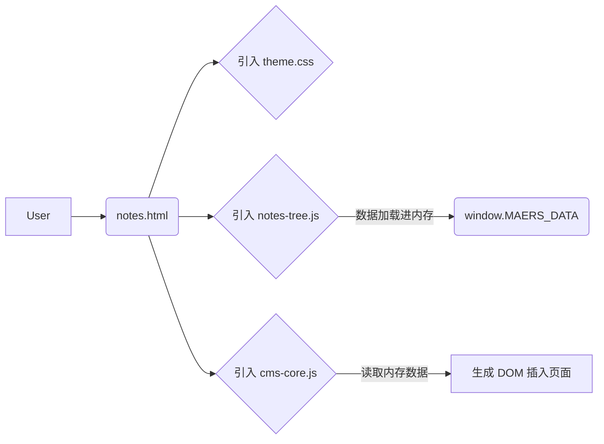
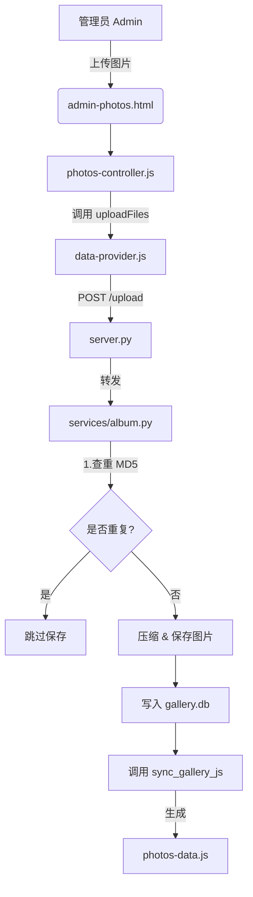

# MAERS SPACE 项目说明书 (v2.7)

www.maersy.com

本文档旨在详细描述 [MAERS-Personal-Web] 项目的架构、目录结构、文件作用及其相互关系。

---

## 📚 文档总索引 (Documentation Index)

本项目包含一套完整的文档体系，请根据需求查阅：

| 文档名称                            | 包含内容                               | 适用场景                |
| :---------------------------------- | :------------------------------------- | :---------------------- |
| **[项目说明书](项目说明书.md)**     | 全局架构、目录结构、改进建议           | **架构理解 / 文件索引** |
| **[细节设计说明](细节设计说明.md)** | 防闪烁机制、脚本优化等微小而关键的设计 | **设计哲学 / 细节探究** |
| **[架构决策记录](架构决策记录.md)** | 设计思路、技术选型、权衡分析           | **深入理解 / 设计参考** |
| **[前端开发指南](前端开发指南.md)** | 样式修改、换肤路由、智能缩放系统       | **前端开发 / UI 定制**  |
| **[后端开发指南](后端开发指南.md)** | API 开发、B站嗅探原理、水印功能实战    | **后端开发 / 功能扩展** |
| **[AI 开发指南](AI开发指南.md)**    | 让 AI 写代码时的 Context 投喂清单      | **AI 辅助开发**         |

### 📖 本文目录 (Table of Contents)

- [1. 项目概览 (Overview)](#1-项目概览-overview)
- [2. 文件与目录详解 (File Structure)](#2-文件与目录详解-file-structure)
- [3. 关键链路图解 (Key Workflows)](#3-关键链路图解-key-workflows)
- [4. 潜在改进方向 (Potential Improvements)](#4-潜在改进方向-potential-improvements)
- [5. 维护指南 (Maintenance)](#5-维护指南-maintenance)
- [6. 依赖环境 (Environment & Dependencies)](#6-依赖环境-environment--dependencies)
- [7. 文档说明 (Documentation)](#7-文档说明-documentation)

---

## 1. 项目概览 (Overview)

| 维度         | 说明                                                                      |
| :----------- | :------------------------------------------------------------------------ |
| **项目名称** | MAERS SPACE                                                               |
| **架构模式** | Hybrid Core (SQLite 后端 + 纯静态前端)                                    |
| **核心理念** | No-Framework (无框架), Glassmorphism (毛玻璃设计), Data-Driven (数据驱动) |

### 核心工作流

1. **后端 (Python/SQLite)**: 负责数据的增删改查。每次变动数据时，自动更新 SQLite 数据库，并"立即"生成静态 JS 文件。
2. **前端 (HTML/CSS/JS)**: 纯静态架构。不请求数据库 API，而是直接读取预生成的 JS 文件 (`window.MAERS_DATA`)。优势：极速加载，无数据库延迟。

---

## 2. 文件与目录详解 (File Structure)

### 2.1 根目录 - 页面入口

此类文件为纯 HTML，无服务端逻辑。

| 文件名                  | 作用描述                                        |
| :---------------------- | :---------------------------------------------- |
| **`index.html`**        | [首页] 展示导航网格 (Notes, Music, Gallery...)  |
| **`admin.html`**        | [后台首页] 管理员入口，提供各模块的管理面板链接 |
| **`admin-cms.html`**    | [CMS管理] 管理笔记/文学/记录的增删改查          |
| **`admin-album.html`**  | [相册管理] 管理相册分类、相册排序               |
| **`admin-photos.html`** | [图片管理] 单个相册内的图片上传、删除、排序     |
| **`admin-music.html`**  | [音乐管理] 管理歌单和 B 站视频关联              |
| **`notes.html`**        | [笔记展示] 读取笔记数据并渲染                   |
| **`literature.html`**   | [文学展示] 读取文学数据并渲染                   |
| **`record.html`**       | [记录展示] 读取记录数据并渲染                   |
| **`album.html`**        | [相册入口] 展示相册分类卡片                     |
| **`photos.html`**       | [画廊展示] 瀑布流显示图片                       |
| **`music.html`**        | [音乐播放] 视频播放器                           |
| **`space.html`**        | [网站收藏] 个人常用的网站书签收藏页             |

### 2.2 `_studio/` - 后端核心

后端的引擎室，负责处理 API 请求和数据管理。

| 文件名                                    | 关键作用                                           |
| :---------------------------------------- | :------------------------------------------------- |
| **`server.py`**                           | [中央路由] 基于 http.server。简单的入口文件。      |
| **`routes.py`**                           | [路由分发] 拦截 /api/ 请求并分发给对应的 Service。 |
| **`config.py`**                           | [配置文件] 定义路径常量 (如 MODULES_JSON_FILE)。   |
| **`clean-images.py`**                     | [工具脚本] 清理未使用的图片文件。                  |
| **`open-file.py`**                        | [工具脚本] 快速文件检索与打开工具。                |
| **`services/`**                           | [服务层] 存放核心业务逻辑模块                      |
| &nbsp;&nbsp;&nbsp;&nbsp;**`cms.py`**      | [CMS服务] 笔记/文学/记录的逻辑。读写 cms.db。      |
| &nbsp;&nbsp;&nbsp;&nbsp;**`album.py`**    | [画廊服务] 图片上传/压缩/查重。读写 gallery.db。   |
| &nbsp;&nbsp;&nbsp;&nbsp;**`music.py`**    | [音乐服务] 歌单管理。读写 music-data.json。        |
| &nbsp;&nbsp;&nbsp;&nbsp;**`bili.py`**     | [B站服务] 获取 Bilibili 视频元信息。               |
| &nbsp;&nbsp;&nbsp;&nbsp;**`category.py`** | [分类服务] 相册分类的增删改查逻辑。                |

### 2.3 `data/` - 数据存储

所有的数据都存储在这里。

| 文件名                   | 类型      | 作用                               |
| :----------------------- | :-------- | :--------------------------------- |
| **`cms.db`**             | SQLite    | 存储笔记、文学、记录的所有文章     |
| **`gallery.db`**         | SQLite    | 存储所有图片的元数据、哈希、排序   |
| **`music-data.json`**    | JSON      | 存储音乐/视频的歌单结构            |
| **`modules.json`**       | JSON      | 存储模块配置 (可动态增删)          |
| **`photos-data.js`**     | JS (Auto) | 含画廊数据的 JSON 对象，供前端读取 |
| **`notes-tree.js`**      | JS (Auto) | 含笔记数据的树状结构               |
| **`literature-tree.js`** | JS (Auto) | 含文学数据的树状结构               |
| **`record-tree.js`**     | JS (Auto) | 含记录数据的树状结构               |
| **`album-config.js`**    | JS (Auto) | 含相册分类配置的同步文件           |

### 2.4 `dynamic-style/` - 动态配置

存放控制页面动态行为和样式的配置。

| 文件名                  | 作用                                                                 |
| :---------------------- | :------------------------------------------------------------------- |
| **`style-injector.js`** | [样式注入] 根据 URL 自动从 modules.json 加载对应皮肤                 |
| **`layout.js`**         | [布局计算] 负责页面通用的布局计算 (如瀑布流)                         |
| **`script.js`**         | [核心交互] 包含自动深色模式、智能缩放系统 (Zoom System) 和配置持久化 |

> **注**: `modules.json` 已移至 `custom/index/admin/` 目录。

### 2.5 `static-style/` - 静态样式系统

项目的"皮肤"与设计系统基础库。

| 文件名               | 作用                                              |
| :------------------- | :------------------------------------------------ |
| **`theme.css`**      | [主题变量] 定义深色/浅色模式颜色变量 (--bg-color) |
| **`components.css`** | [组件库] 定义按钮、卡片、模态框等通用 UI          |
| **`style.css`**      | [基础样式] Reset 和通用排版                       |
| **`responsive.css`** | [响应式] 移动端适配、媒体查询相关样式             |
| **`toast.css`**      | [提示框样式] Toast 弹窗的样式定义                 |
| **`splash.css`**     | [开屏动画] 后台统一开场动画样式                   |
| **`theme-init.js`**  | [主题初始化] 在页面加载前预设主题类名，防止闪烁   |
| **`tilt.js`**        | [3D动效] 首页卡片的 3D 悬停倾斜效果               |

> **注**: 以前位于此目录的模块特定 CSS (如 `cms-common.css`, `gallery-view.css` 等) 现已移至 `custom/` 下的对应模块目录中，实现了真正的模块化。

### 2.6 `data-manage/` - 通用数据层

前端通用的数据交互工具 (非业务逻辑)。

| 文件名                 | 作用                                                          |
| :--------------------- | :------------------------------------------------------------ |
| **`api-client.js`**    | [HTTP客户端] 封装 fetch，处理 GET/POST 请求                   |
| **`data-provider.js`** | [数据工厂] 统一的数据获取接口，判断是读取 本地API 还是 静态JS |

> **注**: 以前位于此目录的业务控制器 (如 `cms-controller.js`) 现已移至 `custom/` 下的对应模块目录中。

### 2.7 `custom/` - 业务逻辑与样式 (核心)

这是前端开发的核心目录，采用 **模块化 (Module-based)** 结构。每个模块内部进一步划分为 `admin` (管理态) 和 `viewer` (访问态)。

#### 目录结构规范：

- **admin/**: 存放仅管理员可见的编辑器、控制器、拖拽逻辑、管理样式。
- **viewer/**: 存放访客可见的渲染器、播放器、视图逻辑、通用样式。

#### 模块详解：

| 模块                          | admin (管理态)                                                                                      | viewer (访问态)                                                                |
| :---------------------------- | :-------------------------------------------------------------------------------------------------- | :----------------------------------------------------------------------------- |
| **`index`** (首页)         | `admin-core.js` (后台核心) `modules.json` (模块配置) `admin.css`                              | `index.css` (首页样式)                                                         |
| **`cms`** (笔记/文学/记录) | `cms-editor.js` (编辑器) `cms-controller.js` (控制器) `cms-drag.js` (拖拽) `admin-cms.css` | `cms-view.js` (渲染引擎) `cms-common.css` (通用样式)                        |
| **`album`** (相册分类)     | `album-admin.js` (管理逻辑) `album-config.json` (配置) `admin-album.css`                      | `album-viewer.css` (卡片样式) `album-config.js` (静态配置)                  |
| **`photos`** (图片流)      | `photos-controller.js` (管理逻辑) `photos-admin.css` (排序/删除样式)                             | `photos-view.js` (瀑布流/灯箱) `photos-viewer.css` (视图样式)               |
| **`music`** (音乐)         | `music-admin.js` (管理逻辑) `music-drag.js` (排序) `admin-music.css`                          | `music-player.js` (播放器) `music-ui.js` (UI逻辑) `music.css` (黑胶样式) |
| **`notes`**                   | -                                                                                                   | `notes.css`                                                                    |
| **`literature`**              | -                                                                                                   | `literature.css`                                                               |
| **`record`**                  | -                                                                                                   | `record.css`                                                                   |

### 2.8 `shared/` - 通用工具

前端通用的工具函数库，被多个页面共享。

| 文件名             | 作用                                                                                 |
| :----------------- | :----------------------------------------------------------------------------------- |
| **`utils.js`**     | [工具库] 包含防抖、时间格式化、安全函数、**搜索工具** (拼音搜索、节点查找、标签筛选) |
| **`templates.js`** | [模板库] 存放一些通用的 HTML 字符串模板                                              |
| **`namespace.js`** | [命名空间] 定义全局 MAERS 命名空间                                                   |
| **`toast.js`**     | [提示框] 全局通用的 Toast 消息弹窗                                                   |

### 2.9 `plugins/` - 第三方库

存放第三方开源库。

| 文件名               | 作用                                                      |
| :------------------- | :-------------------------------------------------------- |
| **`marked.min.js`**  | [Markdown解析] 用于将在 CMS 中编写的 Markdown 转换为 HTML |
| **`vditor-assets/`** | [编辑器资源] Vditor 编辑器所需的 CSS 和 JS 资源           |

### 2.10 `photos/` - 图片仓库

存放所有上传的图片文件。

| 目录              | 作用                                   |
| :---------------- | :------------------------------------- |
| **`images/`**     | [原图] 上传的原始图片 (Original)       |
| **`previews/`**   | [预览图] 压缩后的高清图 (2560px, AVIF) |
| **`thumbnails/`** | [缩略图] 极速加载的小图 (600px, WebP)  |

### 2.11 `ui/` - 静态资源

存放网站的基础静态资源。

| 文件名          | 作用               |
| :-------------- | :----------------- |
| **`icon.svg`**  | 网站图标 (Favicon) |
| **`index.svg`** | 首页 LOGO 图像     |
| **`MAERS.png`** | 网站 LOGO          |
| **`noise.svg`** | 背景纹理素材       |

---

## 3. 关键链路图解 (Key Workflows)

### 场景 A: 访问笔记页面

### 场景 B: 管理员上传图片

---

## 4. 潜在改进方向 (Potential Improvements)

### 4.1 安全性增强

**API 鉴权**

- 当前后台功能仅通过前端判断 `localhost` 来控制访问
- 如果部署到公网，建议增加基于 Token 或 Session 的鉴权机制
- 可以在 `_studio/server.py` 中添加简单的认证中间件

**输入过滤**

- 虽然前端已进行 HTML 转义，后端仍应进行二次校验
- 防止恶意代码注入或 SQL 注入（虽然使用了参数化查询）

### 4.2 扩展性优化

**路由管理**

- 随着功能增加，`routes.py` 可能变得冗长
- 可以考虑实现基于装饰器的路由注册机制
- 或引入轻量框架如 Flask/FastAPI（但会增加依赖）

**模块化拆分**

- 当前的目录结构已按模块分组（`custom/album`, `custom/cms`, `custom/music`）
- 未来可以考虑将每个模块独立打包，实现按需加载

### 4.3 开发体验提升

**快速文件检索**

- **工具名称**: `open-file.py` (位于 `_studio/`)
- **使用方式**: 双击 `_studio/快捷打开文件.bat`
- **功能**:
  - 快速索引项目文件
  - 支持模糊搜索 (输入 partial name)
  - 自动打开文件 (调用系统默认编辑器)
  - 智能忽略 (`node_modules`, `photos`, `data`, `ui`, `说明`, `plugins`)

**热重载**

- 目前修改 Python 代码需要手动重启服务
- 可以集成 `watchdog` 或 `livereload` 实现自动重载
- 前端可以使用 Browser-Sync 实现自动刷新

**调试工具**

- 可以添加开发环境的日志输出
- 考虑集成 Python Debugger (pdb) 或 VS Code 调试配置

---

## 5. 维护指南 (Maintenance)

1. **新增模块入口**: 修改 `dynamic-style/modules.json`
2. **修改相册分类**: 修改 `data/album-config.json` 或直接在 `admin-album.html` 可视化修改
3. **数据备份**: 备份整个 `data/` 文件夹 (含 .db, .json 和 photos/)
4. **服务器迁移**: 复制整个项目，安装 Python，运行 `python _studio/server.py`

---

## 6. 依赖环境 (Environment & Dependencies)

本项目遵循 **Zero-Dependency (零外部依赖)** 理念，无需 `npm install` 或 `pip install`。

### 5.1 Python 环境 (Backend)

- **版本要求**: Python 3.8+
- **核心依赖库**: 仅使用标准库 (Standard Library)
  - `http.server`: 核心 HTTP 服务
  - `json`: 数据序列化
  - `sqlite3`: 数据库交互
  - `urllib`: URL 解析
  - `os`, `sys`, `shutil`: 文件系统操作
- **可选依赖库 (Optional)**:
  - `Pillow`: 用于图片压缩、缩略图生成。如果不安装，相册上传将仅保存原图。
  - `pillow-avif`: 用于支持 AVIF 格式转换。
- **依赖文件**: 无需 `requirements.txt`。

### 5.2 JavaScript 环境 (Frontend)

- **运行环境**: 现代浏览器 (Chrome 90+, Edge 90+, Safari 15+)
- **框架**: Vanilla JS (原生 JavaScript)
- **第三方库**:
  - `marked.min.js`: 位于 `plugins/`，用于 Markdown 解析。
  - `Vditor`: 位于 `plugins/`，所见即所得编辑器。
- **依赖文件**: 无需 `package.json`。

---

## 7. 文档说明 (Documentation)

- **项目说明书**: 即本文档 (`项目说明书.md`)，位于 `_说明/` 目录下。作为项目的主文档。
- **细节设计说明**: `细节设计说明.md`，解释项目中看似不起眼但经过精心打磨的设计细节（如防闪烁机制）。
- **架构决策记录**: `架构决策记录.md`，记录重要的设计决策和技术选型。
- **开发指南**: 包括前端和后端开发指南，提供实用的修改指导。
- **API 文档**: 目前通过 `_studio/routes.py` 代码自文档化。

================================================================================
文档更新时间: 2026-01-18 (v2.8)
