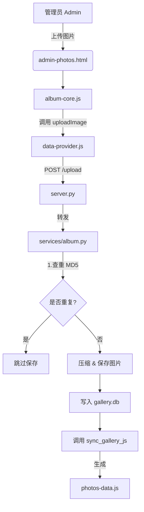

# MAERS SPACE 项目说明书 (v2.7)

本文档旨在详细描述 [MAERS-Personal-Web] 项目的架构、目录结构、文件作用及其相互关系。
(已适配 Windows 11 记事本的表格浏览功能)

---

## 📚 文档总索引 (Documentation Index)

本项目包含一套完整的文档体系，请根据需求查阅：

| 文档名称 | 包含内容 | 适用场景 |
| :--- | :--- | :--- |
| **[项目说明书](项目说明书.md)** | 全局架构、目录结构、改进建议 | **架构理解 / 文件索引** |
| **[细节设计说明](细节设计说明.md)** | **[NEW]** 防闪烁机制、脚本优化等微小而关键的设计 | **设计哲学 / 细节探究** |
| **[架构决策记录](架构决策记录.md)** | 设计思路、技术选型、权衡分析 | **深入理解 / 设计参考** |
| **[前端开发指南](前端开发指南.md)** | 样式修改、换肤路由、智能缩放系统 | **前端开发 / UI 定制** |
| **[后端开发指南](后端开发指南.md)** | API 开发、B站嗅探原理、水印功能实战 | **后端开发 / 功能扩展** |
| **[AI 开发指南](AI开发指南.md)** | 让 AI 写代码时的 Context 投喂清单 | **AI 辅助开发** |

### 📖 本文目录 (Table of Contents)

- [1. 项目概览 (Overview)](#1-项目概览-overview)
- [2. 文件与目录详解 (File Structure)](#2-文件与目录详解-file-structure)
- [3. 关键链路图解 (Key Workflows)](#3-关键链路图解-key-workflows)
- [4. 潜在改进方向 (Potential Improvements)](#4-潜在改进方向-potential-improvements)
- [5. 维护指南 (Maintenance)](#5-维护指南-maintenance)
- [6. 依赖环境 (Environment & Dependencies)](#6-依赖环境-environment--dependencies)
- [7. 文档说明 (Documentation)](#7-文档说明-documentation)

---

## 1. 项目概览 (Overview)

|维度|说明|
|:---|:---|
|**项目名称**|MAERS SPACE|
|**架构模式**|Hybrid Core (SQLite 后端 + 纯静态前端)|
|**核心理念**|No-Framework (无框架), Glassmorphism (毛玻璃设计), Data-Driven (数据驱动)|

### 核心工作流

1. **后端 (Python/SQLite)**: 负责数据的增删改查。每次变动数据时，自动更新 SQLite 数据库，并"立即"生成静态 JS 文件。
3. **前端 (HTML/CSS/JS)**: 纯静态架构。不请求数据库 API，而是直接读取预生成的 JS 文件 (`window.MAERS_DATA`)。优势：极速加载，无数据库延迟。

### 1.1 核心架构原理：JS 封装 JSON (The "JS-Wrapper" Pattern)

您可能会好奇：**"项目里只有 .db 和 .js，说好的 JSON 去哪了？"**

这就是本架构的精髓所在。我没有直接保存 `.json` 文件，而是将 JSON 数据包装成了 `.js` 脚本：

| 文件类型 | 内容示例 | 浏览器行为 | 优势 |
| :--- | :--- | :--- | :--- |
| **.json** | `{ "id": 1 }` | 需要 `fetch()` 请求 | ❌ 本地打开 (`file://`) 会报 CORS 跨域错误 |
| **.js** | `window.DATA = { "id": 1 }` | `<script src="...">` | ✅ **任何环境都能跑**，无视跨域限制 |

**转换逻辑**：每次 Python 后端修改数据库后，不仅仅是保存数据，还会自动执行以下操作：
1.  读取最新数据。
2.  序列化为 JSON 字符串。
3.  拼接前缀 `window.MAERS_DATA = `。
4.  保存为 `.js` 文件 (例如 `data/notes-tree.js`)。

这也解释了为什么您在文件夹里看到的是 `.js` —— **它们本质上就是穿了 JS 马甲的静态 JSON。**

---

## 2. 文件与目录详解 (File Structure)

### 2.1 根目录 - 页面入口

此类文件为纯 HTML，无服务端逻辑。

|文件名|作用描述|
|:---|:---|
|**`index.html`**|[首页] 展示导航网格 (Notes, Music, Gallery...)|
|**`admin.html`**|[后台首页] 管理员入口，提供各模块的管理面板链接|
|**`admin-cms.html`**|[CMS管理] 管理笔记/文学/记录的增删改查|
|**`admin-album.html`**|[相册管理] 管理相册分类、相册排序|
|**`admin-photos.html`**|[图片管理] 单个相册内的图片上传、删除、排序|
|**`admin-music.html`**|[音乐管理] 管理歌单和 B 站视频关联|
|**`notes.html`**|[笔记展示] 读取笔记数据并渲染|
|**`literature.html`**|[文学展示] 读取文学数据并渲染|
|**`record.html`**|[记录展示] 读取记录数据并渲染|
|**`album.html`**|[相册入口] 展示相册分类卡片|
|**`photos.html`**|[画廊展示] 瀑布流显示图片|
|**`music.html`**|[音乐播放] 视频播放器|
|**`space.html`**|[网站收藏] 个人常用的网站书签收藏页|
### 2.2 `_studio/` - 后端核心

后端的引擎室，负责处理 API 请求和数据管理。

|文件名|关键作用|
|:---|:---|
|**`server.py`**|[中央路由] 基于 http.server。简单的入口文件。|
|**`routes.py`**|[路由分发] 拦截 /api/ 请求并分发给对应的 Service。|
|**`config.py`**|[配置文件] 定义路径常量 (如 MODULES_JSON_FILE)。|
|**`clean-images.py`**|[工具脚本] 清理未使用的图片文件。|
|**`open-file.py`**|[工具脚本] 快速文件检索与打开工具。|
|**`services/`**|[服务层] 存放核心业务逻辑模块|
|&nbsp;&nbsp;&nbsp;&nbsp;**`cms.py`**|[CMS服务] 笔记/文学/记录的逻辑。读写 cms.db。|
|&nbsp;&nbsp;&nbsp;&nbsp;**`album.py`**|[画廊服务] 图片上传/压缩/查重。读写 gallery.db。|
|&nbsp;&nbsp;&nbsp;&nbsp;**`music.py`**|[音乐服务] 歌单管理。读写 music-data.json。|
|&nbsp;&nbsp;&nbsp;&nbsp;**`bili.py`**|[B站服务] 获取 Bilibili 视频元信息。|
|&nbsp;&nbsp;&nbsp;&nbsp;**`category.py`**|[分类服务] 相册分类的增删改查逻辑。|

### 2.3 `data/` - 数据存储

所有的数据都存储在这里。

|文件名|类型|作用|
|:---|:---|:---|
|**`cms.db`**|SQLite|存储笔记、文学、记录的所有文章|
|**`gallery.db`**|SQLite|存储所有图片的元数据、哈希、排序|
|**`music-data.json`**|JSON|存储音乐/视频的歌单结构|
|**`modules.json`**|JSON|存储模块配置 (可动态增删)|
|**`photos-data.js`**|JS (Auto)|含画廊数据的 JSON 对象，供前端读取|
|**`notes-tree.js`**|JS (Auto)|含笔记数据的树状结构|
|**`literature-tree.js`**|JS (Auto)|含文学数据的树状结构|
|**`record-tree.js`**|JS (Auto)|含记录数据的树状结构|
|**`album-config.js`**|JS (Auto)|含相册分类配置的同步文件|

### 2.4 `dynamic-style/` - 动态配置

存放控制页面动态行为和样式的配置。

|文件名|作用|
|:---|:---|
|**`modules.json`**|[模块配置] 定义系统有哪些模块 (Title, Icon, URL, CSS)|
|**`style-injector.js`**|[样式注入] 根据 URL 自动从 modules.json 加载对应皮肤|
|**`layout.js`**|[布局计算] 负责页面通用的布局计算 (如瀑布流)|
|**`script.js`**|[核心交互] 包含自动深色模式、智能缩放系统 (Zoom System) 和配置持久化|

### 2.5 `static-style/` - 静态样式

项目的"皮肤"与设计系统。

|文件名|作用|
|:---|:---|
|**`theme.css`**|[主题变量] 定义深色/浅色模式颜色变量 (--bg-color)|
|**`components.css`**|[组件库] 定义按钮、卡片、模态框等通用 UI|
|**`style.css`**|[基础样式] Reset 和通用排版|
|**`cms-common.css`**|[CMS样式] 左右分栏布局 (树状目录 + 编辑器)|
|**`gallery-common.css`**|[画廊通用] 图片网格、分类卡片等画廊基础样式|
|**`gallery-view.css`**|[画廊视图] 灯箱(Lightbox)、悬停效果等查看相关样式|
|**`gallery-admin.css`**|[画廊管理] 后台图片选中、拖拽、排序按钮等管理样式|
|**`responsive.css`**|[响应式] 移动端适配、媒体查询相关样式|
|**`toast.css`**|[提示框样式] Toast 弹窗的样式定义|
|**`theme-init.js`**|[主题初始化] 在页面加载前预设主题类名，防止闪烁|
|**`tilt.js`**|[3D动效] 首页卡片的 3D 悬停倾斜效果|
|**`html/`**|[页面特有样式] 存放各个 HTML 页面独有的 CSS 文件|
|&nbsp;&nbsp;`admin.css`| 后台首页样式 |
|&nbsp;&nbsp;`admin-album.css`| 相册管理页面样式 |
|&nbsp;&nbsp;`admin-cms.css`| CMS 管理页面样式 |
|&nbsp;&nbsp;`admin-music.css`| 音乐管理页面样式 |
|&nbsp;&nbsp;`index.css`| 首页样式 |
|&nbsp;&nbsp;`music.css`| 音乐页面样式 (黑胶唱片、播放器) |
|&nbsp;&nbsp;`notes.css`| 笔记页面微调样式 |
|&nbsp;&nbsp;`literature.css`| 文学页面微调样式 |
|&nbsp;&nbsp;`record.css`| 记录页面微调样式 |

### 2.6 `data-manage/` - 前端数据层

前端的数据交互层 (MVVM 中的 Model 层)。

|文件名|作用|
|:---|:---|
|**`api-client.js`**|[HTTP客户端] 封装 fetch，处理 GET/POST 请求|
|**`data-provider.js`**|[数据服务] 判断是读取 本地API 还是 静态JS|
|**`cms-controller.js`**|[CMS控制器] CMS模块的状态管理与API交互|
|**`album-controller.js`**|[相册控制器] 相册模块的数据管理逻辑|
|**`admin-core.js`**|[后台核心] 后台首页的模块管理逻辑|
|**`music-admin.js`**|[音乐管理] 音乐模块的增删改查逻辑|

### 2.7 `custom/` - 定制业务逻辑

存放特定模块的定制化前端逻辑，按模块分组。

| 文件/目录 | 作用 |
| :--- | :--- |
| **`album/`** | [相册模块] 相册相关的视图和管理逻辑 |
| &nbsp;&nbsp;`album-view.js` | 相册展示、瀑布流渲染、灯箱查看器 |
| &nbsp;&nbsp;`album-admin.js` | 相册后台管理、拖拽排序逻辑 |
| **`cms/`** | [CMS模块] 笔记/文学/记录的视图和编辑器 |
| &nbsp;&nbsp;`cms-view.js` | 搜索UI、标签UI、渲染引擎、图片灯箱 |
| &nbsp;&nbsp;`cms-editor.js` | Vditor 编辑器的初始化与配置 |
| &nbsp;&nbsp;`cms-drag.js` | 文档/文件夹的拖拽排序逻辑 |
| **`music/`** | [音乐模块] 播放器、UI、拖拽、状态管理 |
| &nbsp;&nbsp;`music-ui.js` | 核心 UI 逻辑、搜索索引构建 |
| &nbsp;&nbsp;`music-player.js` | 播放器控制 (Bilibili/Audio源) |
| &nbsp;&nbsp;`music-render.js` | 列表渲染逻辑 |
| &nbsp;&nbsp;`music-control.js` | 播放控制逻辑 |
| &nbsp;&nbsp;`music-drag.js` | 歌单拖拽排序 |
| &nbsp;&nbsp;`music-state.js` | 播放状态管理 (PlayState/LoopMode) |

### 2.8 `shared/` - 通用工具

前端通用的工具函数库，被多个页面共享。

| 文件名 | 作用 |
| :--- | :--- |
| **`utils.js`** | [工具库] 包含防抖、时间格式化、安全函数、**搜索工具** (拼音搜索、节点查找、标签筛选) |
| **`templates.js`** | [模板库] 存放一些通用的 HTML 字符串模板 |
| **`namespace.js`** | [命名空间] 定义全局 MAERS 命名空间 |
| **`toast.js`** | [提示框] 全局通用的 Toast 消息弹窗 |

### 2.9 `plugins/` - 第三方库

存放第三方开源库。

| 文件名 | 作用 |
| :--- | :--- |
| **`marked.min.js`** | [Markdown解析] 用于将在 CMS 中编写的 Markdown 转换为 HTML |
| **`vditor-assets/`** | [编辑器资源] Vditor 编辑器所需的 CSS 和 JS 资源 |

### 2.10 `photos/` - 图片仓库

存放所有上传的图片文件。

| 目录 | 作用 |
| :--- | :--- |
| **`images/`** | [原图] 上传的原始图片 (Original) |
| **`previews/`** | [预览图] 压缩后的高清图 (2560px, AVIF) |
| **`thumbnails/`** | [缩略图] 极速加载的小图 (600px, WebP) |

### 2.11 `ui/` - 静态资源

存放网站的基础静态资源。

| 文件名 | 作用 |
| :--- | :--- |
| **`icon.svg`** | 网站图标 (Favicon) |
| **`index.svg`** | 首页 LOGO 图像 |
| **`MAERS.png`** | 网站 LOGO |
| **`noise.svg`** | 背景纹理素材 |

---

## 3. 关键链路图解 (Key Workflows)

### 场景 A: 访问笔记页面

### 场景 B: 管理员上传图片

---

## 4. 潜在改进方向 (Potential Improvements)

### 4.1 安全性增强

**API 鉴权**
- 当前后台功能仅通过前端判断 `localhost` 来控制访问
- 如果部署到公网，建议增加基于 Token 或 Session 的鉴权机制
- 可以在 `_studio/server.py` 中添加简单的认证中间件

**输入过滤**
- 虽然前端已进行 HTML 转义，后端仍应进行二次校验
- 防止恶意代码注入或 SQL 注入（虽然使用了参数化查询）

### 4.2 扩展性优化

**路由管理**
- 随着功能增加，`routes.py` 可能变得冗长
- 可以考虑实现基于装饰器的路由注册机制
- 或引入轻量框架如 Flask/FastAPI（但会增加依赖）

**模块化拆分**
- 当前的目录结构已按模块分组（`custom/album`, `custom/cms`, `custom/music`）
- 未来可以考虑将每个模块独立打包，实现按需加载

### 4.3 开发体验提升

**快速文件检索**
- **工具名称**: `open-file.py` (位于 `_studio/`)
- **使用方式**: 双击 `_studio/快捷打开文件.bat`
- **功能**:
    - 快速索引项目文件
    - 支持模糊搜索 (输入 partial name)
    - 自动打开文件 (调用系统默认编辑器)
    - 智能忽略 (`node_modules`, `photos`, `data`, `ui`, `说明`, `plugins`)

**热重载**
- 目前修改 Python 代码需要手动重启服务
- 可以集成 `watchdog` 或 `livereload` 实现自动重载
- 前端可以使用 Browser-Sync 实现自动刷新

**调试工具**
- 可以添加开发环境的日志输出
- 考虑集成 Python Debugger (pdb) 或 VS Code 调试配置

---

## 5. 维护指南 (Maintenance)

1. **新增模块入口**: 修改 `dynamic-style/modules.json`
2. **修改相册分类**: 修改 `data/album-config.json` 或直接在 `admin-album.html` 可视化修改
3. **数据备份**: 备份整个 `data/` 文件夹 (含 .db, .json 和 photos/)
4. **服务器迁移**: 复制整个项目，安装 Python，运行 `python _studio/server.py`

---

## 6. 依赖环境 (Environment & Dependencies)

本项目遵循 **Zero-Dependency (零外部依赖)** 理念，无需 `npm install` 或 `pip install`。

### 5.1 Python 环境 (Backend)
*   **版本要求**: Python 3.8+
*   **核心依赖库**: 仅使用标准库 (Standard Library)
    *   `http.server`: 核心 HTTP 服务
    *   `json`: 数据序列化
    *   `sqlite3`: 数据库交互
    *   `urllib`: URL 解析
    *   `os`, `sys`, `shutil`: 文件系统操作
*   **可选依赖库 (Optional)**: 
    *   `Pillow`: 用于图片压缩、缩略图生成。如果不安装，相册上传将仅保存原图。
    *   `pillow-avif`: 用于支持 AVIF 格式转换。
*   **依赖文件**: 无需 `requirements.txt`。

### 5.2 JavaScript 环境 (Frontend)
*   **运行环境**: 现代浏览器 (Chrome 90+, Edge 90+, Safari 15+)
*   **框架**: Vanilla JS (原生 JavaScript)
*   **第三方库**:
    *   `marked.min.js`: 位于 `plugins/`，用于 Markdown 解析。
    *   `Vditor`: 位于 `plugins/`，所见即所得编辑器。
*   **依赖文件**: 无需 `package.json`。

---

## 7. 文档说明 (Documentation)

*   **项目说明书**: 即本文档 (`项目说明书.md`)，位于 `_说明/` 目录下。作为项目的权威架构文档。
*   **细节设计说明**: `细节设计说明.md`，解释项目中看似不起眼但经过精心打磨的设计细节（如防闪烁机制）。
*   **架构决策记录**: `架构决策记录.md`，记录重要的设计决策和技术选型。
*   **开发指南**: 包括前端和后端开发指南，提供实用的修改指导。
*   **API 文档**: 目前通过 `_studio/routes.py` 代码自文档化。

================================================================================
文档更新时间: 2026-01-17 (v2.7)
